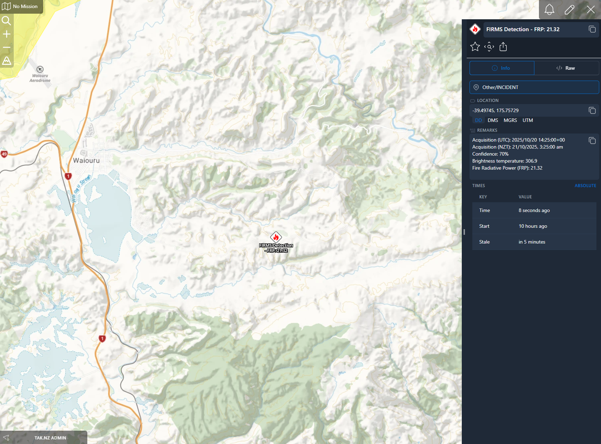

# ETL-FIRMS-NZ

<p align='center'>NASA FIRMS (Fire Information for Resource Management System) wildfire data for New Zealand</p>

## Data Source

| Data Provider | API Endpoint | Content |
|---|---|---|
| NASA FIRMS | https://firms.modaps.eosdis.nasa.gov/api/area/csv/YourMapKey/SOURCE/COORDINATES/DAYS | Active fire detections from multiple satellites |

### Data Sources

| Source | Satellite | Processing | Description |
|---|---|---|---|
| MODIS_NRT | Terra/Aqua | Near Real-Time | MODIS fire detections with minimal delay |
| VIIRS_SNPP_NRT | Suomi-NPP | Near Real-Time | VIIRS fire detections from S-NPP satellite |
| VIIRS_NOAA20_NRT | NOAA-20 | Near Real-Time | VIIRS fire detections from NOAA-20 satellite |
| VIIRS_NOAA21_NRT | NOAA-21 | Near Real-Time | VIIRS fire detections from NOAA-21 satellite |

### Enrichment Sources

When land cover masking and/or fire season awareness are enabled, the ETL queries additional NZ data sources:

| Data Provider | API | Content | Auth |
|---|---|---|---|
| Manaaki Whenua / Landcare Research | [LRIS WFS](https://lris.scinfo.org.nz/) | LCDB v6.0 land cover classification | API key (free) |
| Fire and Emergency NZ (FENZ) | [ArcGIS REST](https://www.checkitsalright.nz/) | Fire season status, DoC land, Section 52 prohibitions | None |

## Features

### Core
- Fetches fire detections from NASA FIRMS (CSV + KML sources) across 4 satellites
- Deduplicates detections across sources, keeping highest confidence
- Filters by minimum confidence and fire radiative power (FRP)
- Optional fire pixel footprint polygons (375m VIIRS, 1km MODIS)

### Land Cover Masking
Classifies each detection by NZ land cover type using LCDB v6.0, enabling intelligent filtering:

| Risk Level | Land Cover | Behaviour |
|---|---|---|
| Critical | Indigenous Forest, Exotic Forest | Always alert — bypasses all FRP filters |
| High | Broadleaved Indigenous Hardwoods, Deciduous Hardwoods | Alert if FRP exceeds threshold |
| Medium | Manuka/Kanuka, Matagouri, Sub Alpine Shrubland, Fernland, Flaxland | Alert if FRP exceeds threshold, or at night, or corroborated |
| Low | Grassland, Cropland, Orchards, Gorse/Broom | Likely farm/scrub burn — filtered unless FRP is high, at night, or corroborated |
| Ignore | Built-up Area, Transport Infrastructure, Surface Mine | Filtered when urban heat filter is enabled |

### Detection Clustering
Scans the detection batch for nearby fires (within 500m / 2 hours). Corroborated detections — where multiple pixels or satellite passes confirm the same fire — bypass FRP thresholds for Medium/Low risk land cover.

### Fire Season Awareness
Queries FENZ fire season status for each detection location:
- **Open** season: raises FRP thresholds by 1.5× for low-risk land (farmers are legally burning)
- **Restricted/Prohibited** season: bypasses FRP thresholds for low-risk land (any fire is suspicious)
- Includes DoC conservation land upgrade (Open → Restricted) and Section 52 activity-specific prohibitions

### Night-time Override
Detections between 9 PM – 6 AM NZST/NZDT on Medium/Low risk land bypass FRP thresholds. Farmers don't burn at night.

### Ephemeral State
Assessments (land cover, fire season, clustering) are cached across Lambda invocations. Since FIRMS reports the same detection for up to 24 hours, this avoids redundant API calls on subsequent polling cycles.

## Example Data



## Deployment

Deployment into the CloudTAK environment for ETL tasks is done via automatic releases to the TAK.NZ AWS environment.

Github actions will build and push docker releases on every version tag which can then be automatically configured via the
CloudTAK API.

### GitHub Actions Setup

The workflow uses GitHub variables and secrets to make it reusable across different ETL repositories.

#### Organization Variables (recommended)
- `DEMO_STACK_NAME`: Name of the demo stack (default: "Demo")
- `PROD_STACK_NAME`: Name of the production stack (default: "Prod")

#### Organization Secrets (recommended)
- `DEMO_AWS_ACCOUNT_ID`: AWS account ID for demo environment
- `DEMO_AWS_REGION`: AWS region for demo environment
- `DEMO_AWS_ROLE_ARN`: IAM role ARN for demo environment
- `PROD_AWS_ACCOUNT_ID`: AWS account ID for production environment
- `PROD_AWS_REGION`: AWS region for production environment
- `PROD_AWS_ROLE_ARN`: IAM role ARN for production environment

#### Repository Variables
- `ETL_NAME`: Name of the ETL (default: repository name)

#### Repository Secrets (alternative to organization secrets)
- `AWS_ACCOUNT_ID`: AWS account ID for the environment
- `AWS_REGION`: AWS region for the environment
- `AWS_ROLE_ARN`: IAM role ARN for the environment

These variables and secrets can be set in the GitHub organization or repository settings under Settings > Secrets and variables.

### Manual Deployment

For manual deployment you can use the `scripts/etl/deploy-etl.sh` script from the [CloudTAK](https://github.com/TAK-NZ/CloudTAK/) repo.
As an example: 
```
../CloudTAK/scripts/etl/deploy-etl.sh Demo v1.0.0 --profile tak-nz-demo
```

### CloudTAK Configuration

When registering this ETL as a task in CloudTAK:

- Use the `<repo-name>.png` file in the main folder of this repository as the Task Logo
- Use the raw GitHub URL of this README.md file as the Task Markdown Readme URL

This will ensure proper visual identification and documentation for the task in the CloudTAK interface.

## Development

TAK.NZ provided Lambda ETLs are currently all written in [NodeJS](https://nodejs.org/en) through the use of a AWS Lambda optimized
Docker container. Documentation for the Dockerfile can be found in the [AWS Help Center](https://docs.aws.amazon.com/lambda/latest/dg/images-create.html)

```sh
npm install
```

Set the necessary environment variables to communicate with a local ETL server.
When the ETL is deployed the `ETL_API` and `ETL_LAYER` variables will be provided by the Lambda Environment

```bash
export ETL_API="http://localhost:5001"
export ETL_LAYER="19"
export MAP_KEY="your-nasa-firms-map-key"
export BBOX="-47.3,166.3,-34.4,178.6"
export MIN_CONFIDENCE="40"
export MIN_FRP="5"
export SHOW_FOOTPRINT="false"
export LAND_COVER_MASKING="true"
export LRIS_API_KEY="your-lris-api-key"
export FIRE_SEASON_AWARE="true"
export FILTER_URBAN_HEAT="true"
```

Get your NASA FIRMS Map Key from: https://firms.modaps.eosdis.nasa.gov/api/

Get your LRIS API Key (free) from: https://lris.scinfo.org.nz/ (requires access to layer-123148, LCDB v6.0)

### Configuration Reference

| Setting | Default | Recommended | Description |
|---|---|---|---|
| `MAP_KEY` | — | — | NASA FIRMS Map Key (required) |
| `BBOX` | `-47.3,166.3,-34.4,178.6` | (default) | Bounding box: minLat,minLon,maxLat,maxLon |
| `MIN_CONFIDENCE` | `50` | `40` | Minimum confidence %. Lower to include borderline detections that clustering can validate. |
| `MIN_FRP` | `20` | `5` | Minimum FRP (MW). Set low and let land cover thresholds handle filtering per risk level. |
| `SHOW_FOOTPRINT` | `false` | `false` | Show fire pixel footprint polygon on map |
| `LAND_COVER_MASKING` | `false` | `true` | Enable LCDB v6.0 land cover classification. Requires `LRIS_API_KEY`. |
| `LRIS_API_KEY` | — | — | LRIS API key for land cover lookups. Free at https://lris.scinfo.org.nz/ |
| `FRP_THRESHOLD_HIGH` | `10` | `10` | Min FRP (MW) for High risk classes (Broadleaved Hardwoods) |
| `FRP_THRESHOLD_MEDIUM` | `25` | `20` | Min FRP (MW) for Medium risk classes (Manuka/Kanuka, Scrub) |
| `FRP_THRESHOLD_LOW_SCRUB` | `30` | `30` | Min FRP (MW) for Gorse/Broom |
| `FRP_THRESHOLD_LOW_GRASS` | `40` | `35` | Min FRP (MW) for Grassland/Cropland |
| `FILTER_URBAN_HEAT` | `false` | `true` | Filter out detections on urban land cover |
| `FIRE_SEASON_AWARE` | `false` | `true` | Enable FENZ fire season lookups (no key required) |

To run the task, ensure the local [CloudTAK](https://github.com/TAK-NZ/CloudTAK/) server is running and then run with typescript runtime
or build to JS and run natively with node

```
ts-node task.ts
```

```
npm run build
node dist/task.js
```

## License

TAK.NZ is distributed under [AGPL-3.0-only](LICENSE)  
Copyright (C) 2025 - Christian Elsen, Team Awareness Kit New Zealand (TAK.NZ)